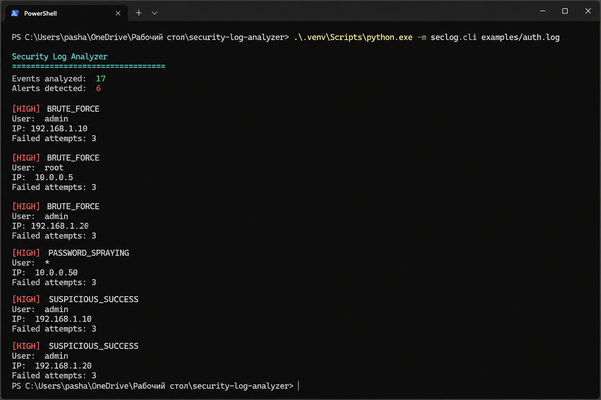

# Security Log Analyzer

[](https://github.com/pasha20yuz-pixel/security-log-analyzer/actions/workflows/tests.yml)

A Python-based defensive security tool for analyzing authentication logs and detecting suspicious login activity.

The project correlates authentication events within configurable time windows to identify common attack patterns such as brute-force attacks, password spraying, and suspicious successful logins.

Built as an Information Security portfolio project to demonstrate Python development, security monitoring concepts, automated testing, CLI design, code quality practices, and CI with GitHub Actions.

## CLI Demo



The analyzer provides both human-readable and machine-readable JSON output.

## Features

- Authentication log parsing and validation
- Brute-force attack detection
- Password spraying detection
- Suspicious successful login detection
- Configurable detection thresholds
- Configurable time windows
- Human-readable CLI output
- JSON output for integration with other tools
- CLI argument validation
- Invalid log data handling
- 31 automated tests
- 97.6% test coverage
- Ruff static analysis and linting
- GitHub Actions CI

## Detection Capabilities

### Brute Force

Detects repeated failed login attempts against the same user from the same IP address within a configurable time window.

### Password Spraying

Detects failed authentication attempts against multiple users from the same IP address within a configurable time window.

### Suspicious Successful Login

Detects a successful login that follows multiple failed authentication attempts from the same user and IP address within a configurable time window.

## Architecture

```text
                         Authentication Log
                                  |
                                  v
                               Parser
                                  |
                                  v
                              LogEvent[]
                                  |
                                  v
                         Detection Engine
                    /             |              \
                   v              v               v
             Brute Force   Password Spraying   Suspicious Success
                   \             |              /
                    \            |             /
                         SecurityAlert[]
                                  |
                                  v
                                 CLI
                           /             \
                          v               v
                       Text             JSON
```

The project follows a clear separation of concerns:

- `parser.py` — validates and converts raw log lines into structured `LogEvent` objects.
- `analyzer.py` — contains security detection logic and produces `SecurityAlert` objects.
- `cli.py` — handles command-line arguments, input files, output formatting, and user-facing errors.

## Installation

```bash
git clone https://github.com/pasha20yuz-pixel/security-log-analyzer.git
cd security-log-analyzer
python -m venv .venv
python -m pip install -e ".[dev]"
```

The project requires Python 3.11 or newer.

## Usage

After installation:

```bash
seclog examples/auth.log
```

If the command is not available in the current shell on Windows:

```powershell
.\.venv\Scripts\seclog.exe examples/auth.log
```

You can also run the module directly:

```bash
python -m seclog.cli examples/auth.log
```

Example output:

```text
Security Log Analyzer
==============================
Events analyzed: 17
Alerts detected: 6

[HIGH] BRUTE_FORCE
User: admin
IP: 192.168.1.10
Failed attempts: 3

[HIGH] BRUTE_FORCE
User: root
IP: 10.0.0.5
Failed attempts: 3

[HIGH] BRUTE_FORCE
User: admin
IP: 192.168.1.20
Failed attempts: 3

[HIGH] PASSWORD_SPRAYING
User: *
IP: 10.0.0.50
Failed attempts: 3

[HIGH] SUSPICIOUS_SUCCESS
User: admin
IP: 192.168.1.10
Failed attempts: 3

[HIGH] SUSPICIOUS_SUCCESS
User: admin
IP: 192.168.1.20
Failed attempts: 3
```

## Configuration

### Detection Threshold

```bash
seclog examples/auth.log --threshold 5
```

Default:

```text
threshold = 3
```

### Detection Time Window

```bash
seclog examples/auth.log --window 120
```

Parameters can be combined:

```bash
seclog examples/auth.log --threshold 5 --window 120
```

## JSON Output

```bash
seclog examples/auth.log --format json
```

Example:

```json
{
  "events_analyzed": 17,
  "alerts_detected": 6,
  "alerts": [
    {
      "alert_type": "BRUTE_FORCE",
      "severity": "HIGH",
      "username": "admin",
      "ip_address": "192.168.1.10",
      "failed_attempts": 3
    },
    {
      "alert_type": "BRUTE_FORCE",
      "severity": "HIGH",
      "username": "root",
      "ip_address": "10.0.0.5",
      "failed_attempts": 3
    },
    {
      "alert_type": "BRUTE_FORCE",
      "severity": "HIGH",
      "username": "admin",
      "ip_address": "192.168.1.20",
      "failed_attempts": 3
    },
    {
      "alert_type": "PASSWORD_SPRAYING",
      "severity": "HIGH",
      "username": "*",
      "ip_address": "10.0.0.50",
      "failed_attempts": 3
    },
    {
      "alert_type": "SUSPICIOUS_SUCCESS",
      "severity": "HIGH",
      "username": "admin",
      "ip_address": "192.168.1.10",
      "failed_attempts": 3
    },
    {
      "alert_type": "SUSPICIOUS_SUCCESS",
      "severity": "HIGH",
      "username": "admin",
      "ip_address": "192.168.1.20",
      "failed_attempts": 3
    }
  ]
}
```

JSON output can be used as machine-readable input for other tools or automation.

## Input Log Format

The analyzer expects authentication events in the following format:

```text
timestamp EVENT_TYPE user=USERNAME ip=IP_ADDRESS
```

Example:

```text
2026-08-13 10:15:21 LOGIN_FAILED user=admin ip=192.168.1.10
2026-08-13 10:15:31 LOGIN_FAILED user=admin ip=192.168.1.10
2026-08-13 10:15:41 LOGIN_FAILED user=admin ip=192.168.1.10
2026-08-13 10:16:00 LOGIN_SUCCESS user=admin ip=192.168.1.10
```

Invalid timestamps, malformed events, and invalid input are rejected instead of silently producing potentially misleading security results.

## Security Concepts Demonstrated

This project focuses on defensive security and security monitoring:

- Authentication monitoring
- Brute-force attack detection
- Password spraying
- Suspicious login activity
- Event correlation
- Time-window based detection
- Threshold-based detection
- Security alert generation
- Log analysis
- Detection state management
- Input validation

These concepts are directly relevant to Security Operations, monitoring, detection engineering, and entry-level Information Security roles.

## Testing

Run the complete test suite:

```bash
pytest
```

Current result:

```text
31 passed
```

The tests cover:

- log parsing
- invalid input handling
- brute-force detection
- password spraying
- suspicious successful logins
- time windows
- configurable thresholds
- detection state handling
- CLI behavior
- JSON output
- log-file loading

## Test Coverage

The project currently has **97.6% test coverage**, with a minimum required coverage of 90%.

Run:

```bash
pytest --cov=seclog --cov-report=term-missing
```

Current coverage:

```text
src/seclog/__init__.py    100%
src/seclog/analyzer.py    100%
src/seclog/cli.py          96%
src/seclog/parser.py       94%
TOTAL                      97.60%
```

## Code Quality

Ruff is used for static analysis and linting:

```bash
ruff check .
```

Expected result:

```text
All checks passed!
```

## Continuous Integration

GitHub Actions runs automatically on pushes and pull requests.

The CI pipeline:

1. Sets up Python 3.11
2. Installs the project and development dependencies
3. Runs Ruff
4. Runs the test suite with coverage

Workflow:

```text
.github/workflows/tests.yml
```

## Project Structure

```text
security-log-analyzer/
├── .github/
│   └── workflows/
│       └── tests.yml
├── docs/
│   └── cli-demo.png
├── examples/
│   └── auth.log
├── src/
│   └── seclog/
│       ├── __init__.py
│       ├── analyzer.py
│       ├── cli.py
│       └── parser.py
├── tests/
│   ├── test_analyzer.py
│   ├── test_cli.py
│   └── test_parser.py
├── .gitignore
├── pyproject.toml
├── README.md
└── requirements.txt
```

## Technology Stack

| Technology | Purpose |
|---|---|
| Python 3.11 | Core implementation |
| `argparse` | CLI argument parsing |
| `json` | Machine-readable output |
| `pytest` | Automated testing |
| `pytest-cov` | Test coverage |
| Ruff | Static analysis and linting |
| Git | Version control |
| GitHub | Repository hosting |
| GitHub Actions | Continuous integration |

## Design Principles

### Separation of Concerns

Parsing, security detection, and CLI functionality are separated into independent modules.

### Structured Data

Authentication events and security alerts are represented as structured Python objects instead of relying on unstructured strings throughout the detection logic.

### Configurable Detection

Detection thresholds and time windows can be configured from the CLI.

### Testability

The detection engine is separated from the CLI, allowing security detection logic to be tested independently.

### Input Validation

Invalid input is rejected instead of silently producing potentially incorrect security results.

## Current Status

The project currently provides:

- Authentication log parsing
- Brute-force detection
- Password spraying detection
- Suspicious successful login detection
- Configurable detection parameters
- Human-readable CLI output
- JSON output
- 31 passing tests
- 97.6% test coverage
- Ruff linting
- GitHub Actions CI

## Future Improvements

Potential improvements include:

- Account enumeration detection
- Additional authentication attack patterns
- Support for additional log formats
- Exporting alerts to files
- More detailed incident information
- Performance improvements for large log files

The goal is to expand the project only where a change improves detection capability, maintainability, or practical security-monitoring value.

## Author

### Pavel Yuzhalkin

Saint Petersburg, Russia

[GitHub Repository](https://github.com/pasha20yuz-pixel/security-log-analyzer)
